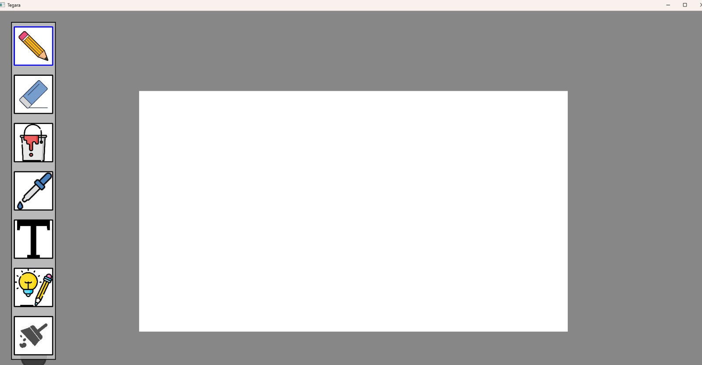
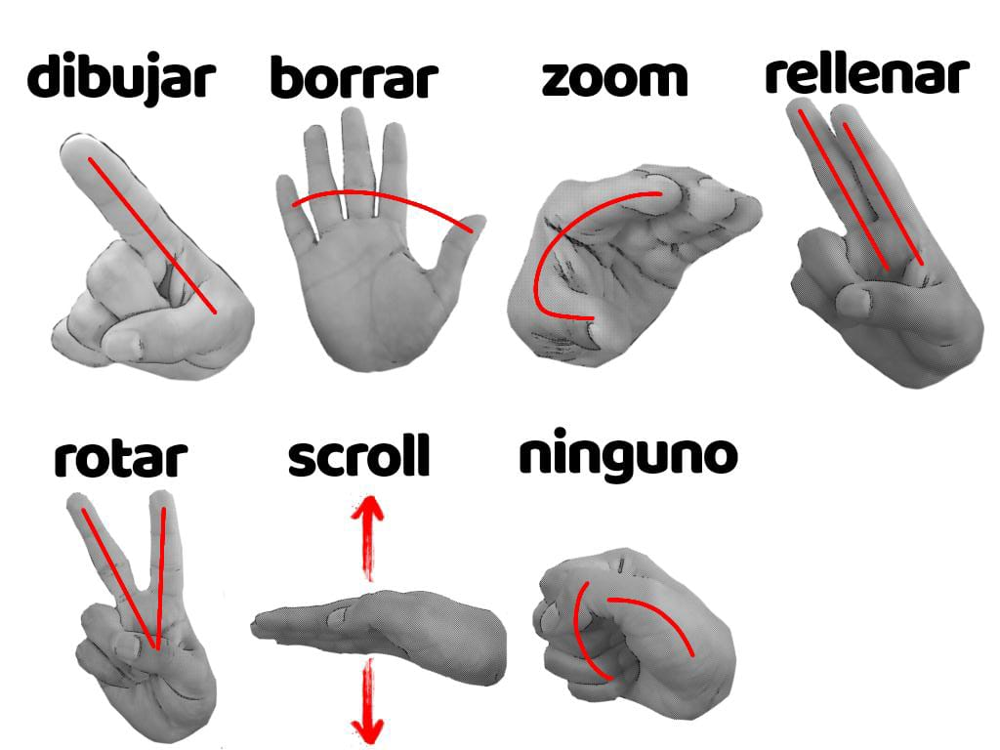
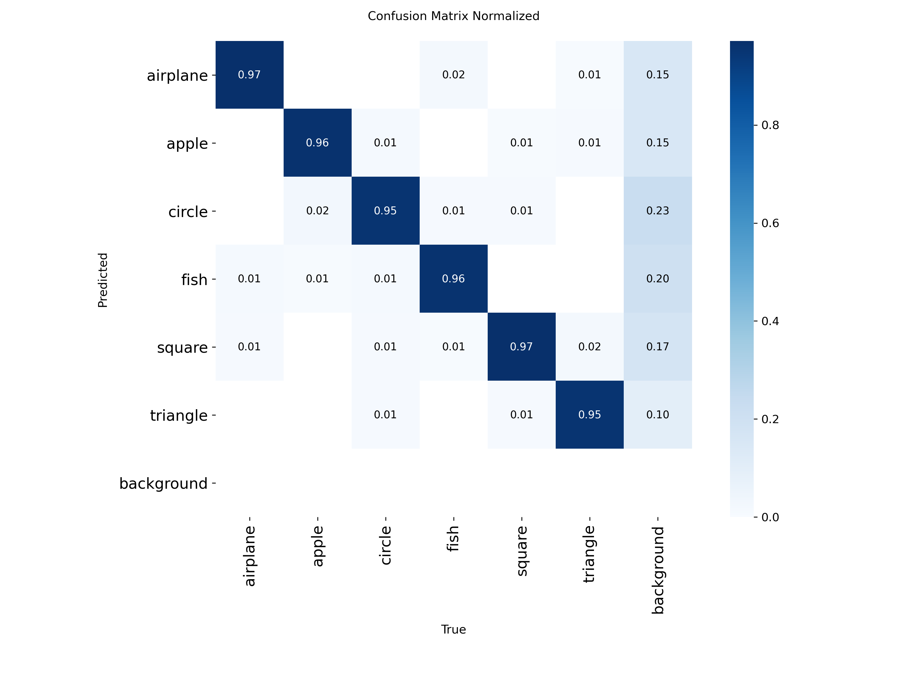
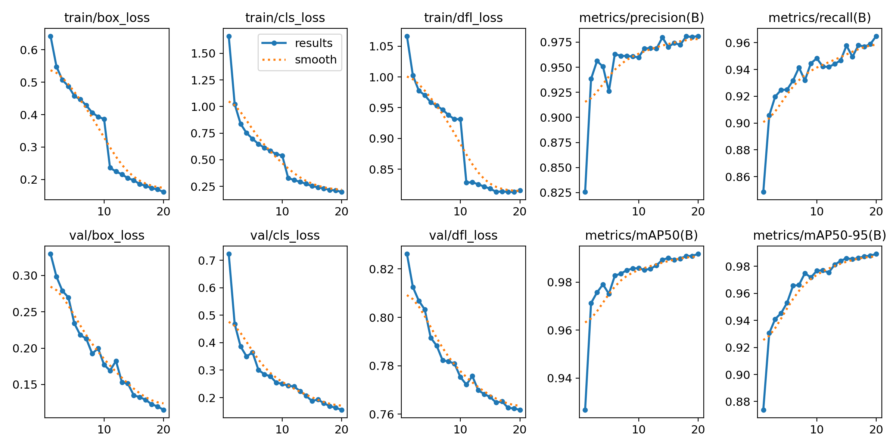
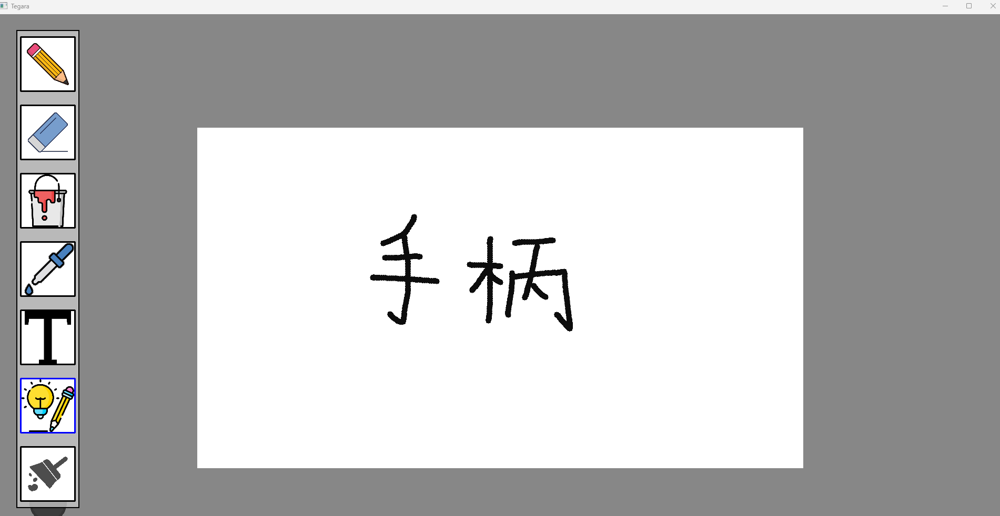
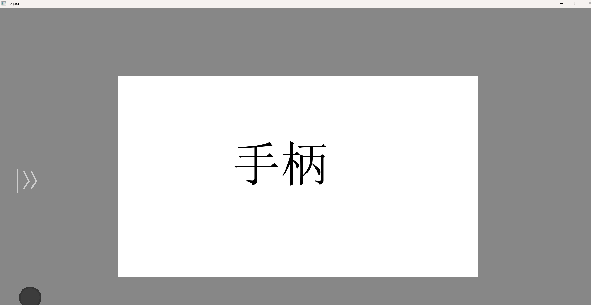

## Tegara - lienzo en aire (Práctica final de VC)

Autores : Anthoy Diego Ávila Arias, Wei Li

### Contenidos
- [Descripción general](#descripción-general)
- [UI de app](#ui-de-app)
- [Flujo de app](#flujo-de-app)
- [Detección y seguimiento de la mano](#detección-y-seguimiento-de-la-mano)
- [Mejora de dibujos mediante detección](#mejora-de-dibujos-mediante-detección)
- [Reconocimiento de texto](#reconocimiento-de-texto)

## Descripción general
La app utiliza MediaPipe para la detección de la mano a través de la cámara, una red neuronal para clasificar gestos, YOLO para clasificar garabatos y mejorar el dibujo, PaddleOCR para detección de texto y mejora, y openCV/Numpy para el tratamiento de imágenes. 

## UI de app

    

## Flujo de app
1. **Captura**: Lee el frame de la webcam y se le aplica un flip (espejo).
2. **Extracción** de Landmarks: MediaPipe localiza los 21 puntos.
3. **Clasificación**: Los puntos se normalizan y se pasan por tu Red Neuronal que decide
el gesto.
4. **Normalización Espacial**: Se transforman las coordenadas de la cámara al tamaño
de la ventana y se aplica un suavizado.
5. **Creación de eventos**: Dada la posición de la mano y el gesto se crea un evento.
6. **Despacho de eventos**: Según el tipo de evento se puede crear un comando (dibujar,
rellenar, borrar, etc.)
7. **Redibujar**: Finalmente, llama a mainFrame, que toma todas las capas de dibujo y
las muestra actualizadas en la ventana de OpenCV.

## Detección y seguimiento de la mano
El sistema permite controlar la aplicación mediante gestos de la mano, sustituyendo el uso del ratón como dispositivo de entrada. Para ello, se emplea MediaPipe, que detecta 21 puntos de referencia de la mano, cada uno con coordenadas espaciales (x, y, z). El punto más relevante es el correspondiente a la punta del dedo índice, utilizado para posicionar el cursor en pantalla. El conjunto completo de puntos se emplea tanto para el seguimiento del movimiento como para la clasificación de gestos.

1. **Procesamiento y normalización**

    Dado que las dimensiones de la cámara y la ventana de la aplicación pueden diferir, las coordenadas detectadas se normalizan y escalan al tamaño de la pantalla. Además, se aplica un suavizado mediante interpolación lineal (LERP) para reducir el efecto de temblor causado por el ruido de la cámara o pequeñas variaciones en la detección.
    Para mejorar la experiencia de usuario, la imagen de la cámara se procesa con un efecto espejo, logrando un control más intuitivo. Todo el procesamiento de detección y clasificación se ejecuta en un hilo independiente, enviando los resultados al programa principal mediante una cola de eventos, lo que mejora el rendimiento general.

2. **Clasificación de gestos**

    A partir de los puntos detectados por MediaPipe, se implementa un clasificador de gestos basado en una red neuronal desarrollada con PyTorch. El sistema reconoce 7 gestos, considerados suficientes para un control fluido de la aplicación:

    

      
    

    El modelo neuronal es ligero y eficiente, con 63 entradas (21 puntos × x, y, z) y 7 salidas, una por cada gesto. El entrenamiento se realiza capturando datos directamente durante la ejecución del programa, lo que permite mejorar progresivamente la precisión del reconocimiento.

## Mejora de dibujos mediante detección
El proyecto incorpora una funcionalidad que permite al usuario dibujar en un lienzo digital y reconocer automáticamente determinados dibujos. Los trazos realizados se procesan mediante un modelo de detección basado en YOLO, que identifica la clase del dibujo y sustituye el trazo original por una representación idealizada correspondiente, mejorando la uniformidad visual del resultado final.

1. **Preparación del dataset**

    Para el entrenamiento del modelo se utilizó el conjunto de datos [Quick, Draw!](https://quickdraw.withgoogle.com/data) de Google, que proporciona dibujos en formato de trazos (NDJSON). Se seleccionaron cinco clases: airplane, apple, circle, fish, square y triangle.

    Con el fin de permitir la detección de múltiples dibujos en un mismo lienzo y aumentar la robustez frente a variaciones de rotación y escala, se generó un conjunto de datos sintético combinando aleatoriamente varios sketches transformados en un mismo lienzo. Mediante este proceso se obtuvieron 5 000 imágenes de entrenamiento y 800 imágenes de validación.

2. **Entrenamiento del modelo**

    Para el entrenamiento se utilizó el modelo YOLOv8n, la variante ligera de YOLOv8, elegida por su bajo coste computacional y su adecuación a aplicaciones interactivas basadas en sketches. El modelo se entrenó con imágenes de 640×640 píxeles durante 20 épocas, lo que resultó suficiente para la convergencia dada la simplicidad de las clases y el tamaño del conjunto de datos generado.

3. **Análisis de resultados**
    

      
    

    La matriz de confusión normalizada refleja un alto rendimiento del modelo en la clasificación de los sketches, con valores superiores al 95 % en la diagonal principal para todas las clases. Las confusiones entre clases son escasas y se concentran principalmente en objetos con geometrías similares, como círculos y manzanas. Asimismo, se observa un porcentaje moderado de objetos clasificados como fondo, lo que indica que el modelo, en determinados casos, opta por no realizar una detección cuando la confianza es baja, un comportamiento habitual y deseable en modelos de detección como YOLO. En conjunto, estos resultados evidencian una correcta capacidad de generalización del modelo entrenado.

    

      
    

    En los gráficos train/box_loss (error en la predicción de las cajas delimitadoras) y train/cls_loss (error en la clasificación de los objetos) se observa una disminución progresiva a lo largo de las épocas de entrenamiento, lo que indica que el modelo aprende de forma estable y mejora gradualmente su precisión.

    Por otro lado, las métricas metrics/precision(B) (proporción de detecciones correctas respecto al total de predicciones) y metrics/recall(B) (porcentaje de objetos reales correctamente detectados) muestran un incremento constante, reflejando una reducción de falsos positivos y un aumento en la capacidad del modelo para identificar correctamente los objetos de interés.

## Reconocimiento de texto
En este proyecto se ha implementado una funcionalidad que permita la conversión de texto manuscrito dibujado por el usuario en un lienzo interactivo en texto digital, facilitando su edición y reutilización posterior.

1. **Preprocesamiento del texto manuscrito**

    Antes de aplicar el reconocimiento OCR, los trazos manuscritos se almacenan en una capa temporal y se someten a un proceso de preprocesamiento con el fin de mejorar la precisión y el rendimiento. Este proceso incluye la normalización de la imagen, convirtiéndola en una representación con fondo blanco y texto negro, y la detección de una región de interés (ROI) que encierra los píxeles dibujados. La región extraída se amplía mediante un padding adicional, fijado experimentalmente en 70 píxeles, logrando un equilibrio adecuado entre precisión y eficiencia computacional.

2. **Reconocimiento OCR**

    El reconocimiento del texto manuscrito se realiza mediante PaddleOCR, seleccionado por su soporte multilenguaje, su buen equilibrio entre precisión y velocidad y su capacidad de ejecución offline. Una vez reconocido el texto, el sistema calcula dinámicamente el tamaño de la fuente y lo renderiza centrado dentro de la región detectada, sustituyendo el trazo manuscrito original. Este proceso evita solapamientos y mantiene la coherencia visual del lienzo, permitiendo además la posterior edición del texto. En la mayoría de los casos, el sistema reconoce correctamente palabras claras y bien separadas, logrando una conversión efectiva de trazo manuscrito a texto digital.

    

        
        
    
